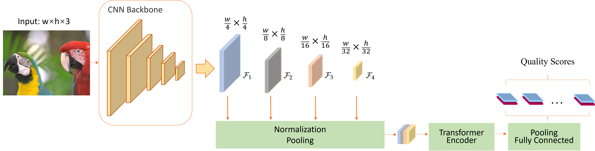

# Deep Ordinal Regression Framework for No-Reference Image Quality Assessment

[Link to the paper](https://ieeexplore.ieee.org/document/10104062)

## Abstract
Due to the rapid development of deep learning techniques, no-reference image quality assessment (NR-IQA) has achieved significant improvement. NR-IQA aims to predict a real-valued variable for image quality, using the image in question as the sole input. Existing deep learning-based NR-IQA models are formulated as a regression problem and trained by minimizing the mean squared error. The error measurement does not consider the relative ordering between different ratings on the quality scale, which consequently affects the efficacy of the model. To account for this problem, we reformulate NR-IQA learning as an ordinal regression problem and propose a simple yet effective framework using deep convolutional neural networks (DCNN) and Transformers. NR-IQA learning is achieved by a deep ordinal loss and using a soft ordinal inference to transform the predicted probabilities to a continuous variable for image quality. Experimental results demonstrate the superiority of our proposed NR-IQA model based on deep ordinal regression. In addition, this framework can be easily extended with various DCNN architectures to build advanced IQA models.

## Network Architecture


## USAGE

1. Place `get_lossfunc.py` and `losses.py` in the same folder as `train.py`.

2. Add the three functions from `DOR-IQA.py` into your model's code:
    - `soft_ordinal_regression`
    - `decode_ord`
    - `inference`

3. Update your `train.py` script with the following code:

```python
from get_lossfunc import create_lossfunc
criterion = create_lossfunc()

def train_epoch():
    # During the training epoch, add the following code:
    labels = labels.unsqueeze(1).unsqueeze(1).unsqueeze(1)  # Labels should be 4-dimensional
    pred_score = DOR_model(image)
    loss = criterion(pred_score, labels)  # The loss function requires predictions to be a probability distribution
    continuous_score = model.inference(pred_score)  # Use the inference function to get the desired score by ordinal regression
```

4. Ensure the above files and functions are correctly integrated to achieve effective NR-IQA using the proposed deep ordinal regression framework.


